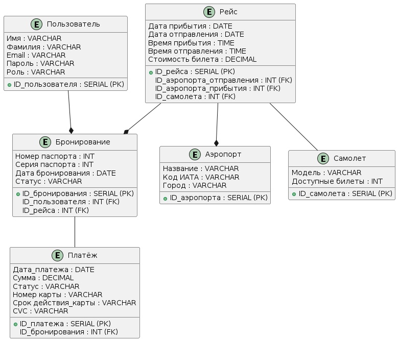

# Flight booking service

## Описание моделей

### Модели предметной области

1. Пользователь

    Представляет данные всех пользователей системы. Содержит базовые данные, необходимые для идентификации, а также роль, определяющую права доступа.

    Атрибуты:
    * ID_пользователя: Уникальный идентификатор пользователя (первичный ключ).
    * Имя: Имя пользователя.
    * Фамилия: Фамилия пользователя.
    * Email: Электронная почта, используется для аутентификации.
    * Пароль: Хэш пароля пользователя.
    * Роль: Указывает тип пользователя, например, "Пассажир" или "Администратор".

2. Рейс

    Хранит информацию о рейсах.

    Атрибуты:
    * ID_рейса: Уникальный идентификатор рейса (первичный ключ).
    * ID_аэропорта_отправления: Идентификатор аэропорта отправления (внешний ключ).
    * ID_аэропорта_прибытия: Идентификатор аэропорта прибытия (внешний ключ).
    * ID_самолета: Внешний ключ, указывающий на самолет, выполняющий рейс.
    * Дата отправления: Дата, когда рейс вылетает.
    * Дата прибытия: Дата, когда рейс прибывает.
    * Время отправления: Время вылета рейса.
    * Время прибытия: Время прибытия рейса.


3. Аэропорт

    Содержит справочную информацию об аэропортах.

    Атрибуты:
    * ID_аэропорта: Уникальный идентификатор аэропорта (первичный ключ).
    * Название: Полное название аэропорта.
    * Код ИАТА: Трехбуквенный код аэропорта, используемый в авиаперевозках.
    * Город: Город, в котором расположен аэропорт.

4. Самолёт

    Содержит информацию о самолетах.

    Атрибуты:
    * ID_самолета: Уникальный идентификатор самолета (первичный ключ).
    * Модель: Название или идентификатор модели самолета.
    * Количество мест: Общее количество доступных мест на борту.
    * Цена билета: Стоимость билета для рейса, выполняемого этим самолетом.

5. Бронирование

    Хранит данные о заказах билетов, привязанных к конкретным рейсам и пользователям.

    Атрибуты:
    * ID_бронирования: Уникальный идентификатор бронирования (первичный ключ).
    * ID_пользователя: Внешний ключ, указывающий на пользователя, сделавшего бронирование.
    * ID_рейса: Внешний ключ, указывающий на рейс, для которого бронируется билет.
    * Имя пассажира: Имя пассажира, для которого бронируется билет (может отличаться от имени пользователя).
    * Номер_паспорта: Номер паспорта пассажира.
    * Серия_паспорта: Серия паспорта пассажира.
    * Дата брони: Дата, когда было создано бронирование.
    * Статус: Состояние бронирования, например, "Подтверждено", "Ожидает оплаты", "Отменено".

6. Платёж
    
    Управляет финансовыми транзакциями, связанными с бронированиями.

    Атрибуты:
    * ID_платежа: Уникальный идентификатор платежа (первичный ключ).
    * ID_бронирования: Внешний ключ, указывающий на бронирование, за которое проводится оплата.
    * Дата оплаты: Дата выполнения платежа.
    * Сумма: Оплаченная сумма.
    * Статус: Состояние платежа, например, "Оплачен", "Ожидает", "Возвращён".
    * Номер_карты: Номер карты, с которой был произведен платеж.
    * Срок_действия_карты: Срок действия карты.
    * CVC: Код CVC карты.

    


### Модели уровня инфраструктуры

#### Сервис авторизации/регистрации

Сервис авторизации и регистрации пользователей предоставляет функциональность для создания новых аккаунтов и проверки учетных данных для входа в систему. Он отвечает за безопасное хранение паролей и управление пользовательскими данными.

#### Сервис бронирования

Сервис бронирования обрабатывает все операции, связанные с поиском рейсов, бронированием мест на рейсах и управлением статусами бронирований. Он отвечает создание рейсов, управление доступностью билетов и бронированиями, а также создание возвратных рейсов.

#### Сервис платежей

Сервис платежей занимается созданием и обновлением статусов платежей, а также отменой платежей.

#### Сервис администрирования БД

Сервис администрирования БД управляет процессом создания и восстановления резервных копий базы данных PostgreSQL.

## Запуск 

Для запуска:

1. `pip install -r requirements.txt`
2. Создаём `docker-compose` для PostreSQL:

    ```
    version: "3.9"
    services:
    postgres:
        image: postgres:13.3
        container_name: PostgresDB
        restart: always
        environment:
        POSTGRES_DB: "postgres"
        POSTGRES_USER: "postgres"
        POSTGRES_PASSWORD: "123456"
        ports:
        - "5432:5432"
        volumes:
        - postgres_db:/var/lib/postgresql/data
        - /home/arnemkova/Flight_Booking_Service/migrations/ddl.sql:/docker-entrypoint-initdb.d/ddl.sql
        - /home/arnemkova/Flight_Booking_Service/migrations/dml.sql:/docker-entrypoint-initdb.d/dml.sql
        - /home/arnemkova/Flight_Booking_Service/src/backups:/backups
    volumes:
    postgres_db:
        driver: local
    ```
    Запускаем: `docker-compose up -d`

3. `streamlit run src/main.py`

Снос бд (для тестирования резервного копирования):

1. `docker exec -it PostgresDB psql -U postgres -d postgres`

2. ```
    DO $$ DECLARE
        r RECORD;
    BEGIN
        FOR r IN (SELECT tablename FROM pg_tables WHERE schemaname = 'public') LOOP
            EXECUTE 'DROP TABLE IF EXISTS ' || quote_ident(r.tablename) || ' CASCADE';
        END LOOP;
    END $$;
    ```